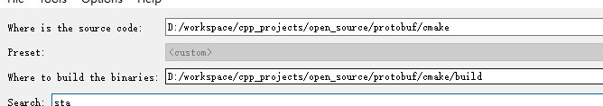
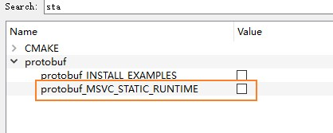
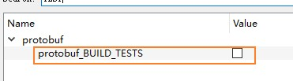
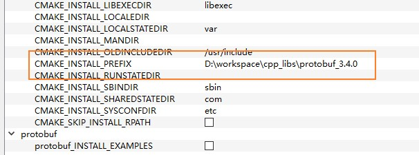
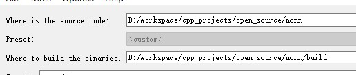
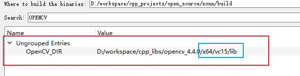
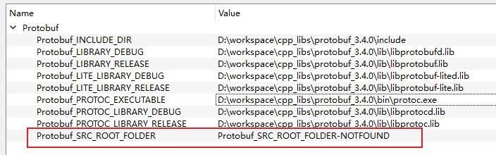
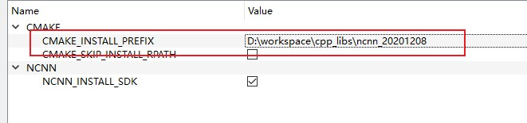

# Windows编译NCNN

1. 编译 protobuf

NCNN推荐使用protobuf 3.4.0版本，参考：[build-for-windows-x64-using-visual-studio-community-2017](https://github.com/Tencent/ncnn/wiki/how-to-build#build-for-windows-x64-using-visual-studio-community-2017)

```shell
git clone https://gitee.com/cmkyec/protobuf.git
git checkout -b 3.4.0 v3.4.0  # 从v3.4.0创建一个分支
```

使用cmake-gui进行配置：

source code选择cmake文件夹



取消选择 protobuf_MSVC_STATIC_RUNTIME



取消选择 protobuf_BUILD_TESTS



配置 CMAKE_INSTALL_PREFIX 的路径（安装路径）



配置好之后，在Visual Studio中进行编译即可。

2. 编译NCNN

```shell
git clone https://gitee.com/cmkyec/ncnn.git
git checkout -b 20201208 20201208
修改.gitmodules中的glslang的url为：https://gitee.com/cmkyec/glslang.git
git submodule init
git submodule update
```

使用cmake-gui进行配置：



配置OpenCV的路径，指定OpenCVConfig.cmake文件夹的路径，**注意需要保持x64/vc15/lib这样的格式**



配置Protobuf的路径，Protobuf_SRC_ROOT_FOLDER可以留空



配置Install的路径



配置好之后，在Visual Studio中进行编译即可。
