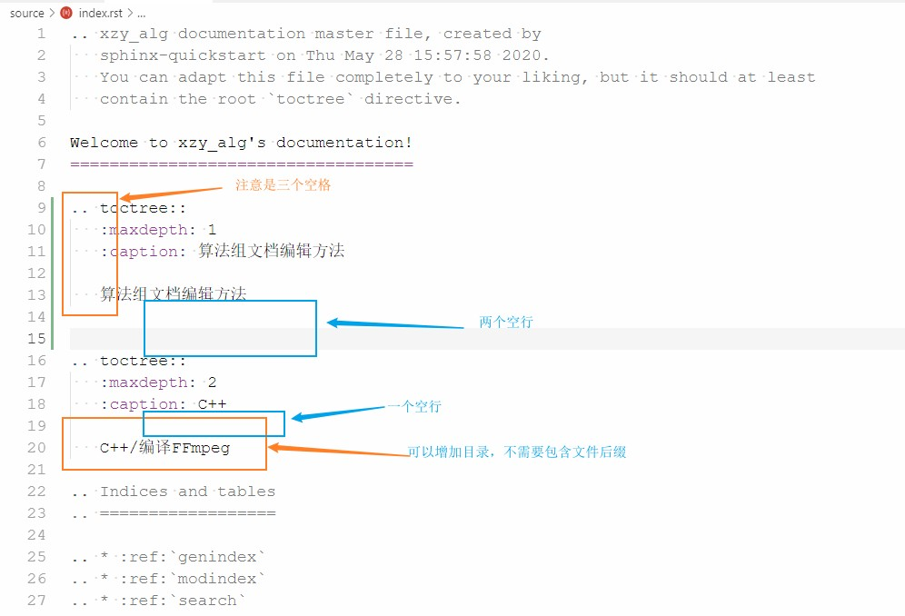

# 算法组文档编辑方法

### 准备Sphinx环境

```shell
pip install sphinx
pip install sphinx-autobuild
pip install sphinx_rtd_theme
pip install recommonmark
```

### 编写Markdown文件

编写相关目标的文档，使用markdown格式，**该文件需要存储到source文件夹下**。

### 更新index.rst文件



### 本地编译并查看效果

```shell
make.bat clean
matk.bat html
```

编译成功后，访问build\html\index.html即可以查看文档在网页上的展示效果。

### 推送到远程

**须本地编译成功，并确认文档显示效果没有问题后，再推送到远程仓库**

```shell
git fetch
git pull  # 首先拉取其他人的远程更新
git push
```


